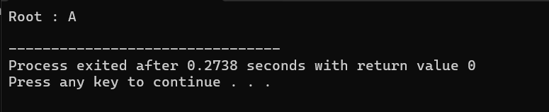
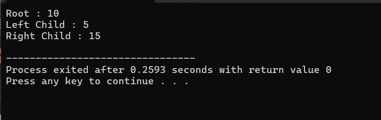
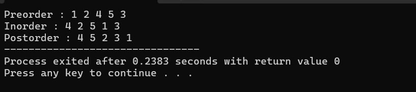

### Node Tree
---

### 1. Cetak Biru Node Pohon (`class TreeNode`)

* **`string data`**: Ruangan untuk menyimpan nilai dari node tersebut (dalam kode ini menggunakan teks/`string`).
* **`vector<TreeNode*> children`**: Ini adalah bagian paling penting. Menggunakan `vector` (array dinamis dari C++) memungkinkan sebuah node untuk menyimpan banyak alamat memori anak (*children*) sekaligus tanpa batasan jumlah, berbeda dengan *Binary Tree* yang anaknya maksimal hanya dua.
* **`TreeNode(string value)`**: Sebuah konstruktor yang bertugas mengisi bagian `data` saat objek node baru pertama kali diciptakan.

### 2. Membuat Induk Utama (`Root`)

```cpp
TreeNode* root = new TreeNode("A");

```

* Di dalam fungsi `main()`, kamu membuat node pertama bernama **A** dan menetapkannya sebagai `root`. *Root* adalah level tertinggi atau fondasi utama dari sebuah struktur data Tree.

### 3. Membuat Node Anak

```cpp
TreeNode* b = new TreeNode("B");
TreeNode* c = new TreeNode("C");
TreeNode* d = new TreeNode("D");

```

* Kamu memesan 3 node baru lagi di memori secara terpisah, masing-masing diberi data **B**, **C**, dan **D**. Pada baris ini, mereka baru sekadar objek yang berdiri sendiri dan belum terhubung ke pohon.

### 4. Menghubungkan Anak ke Induk (`push_back`)

```cpp
root->children.push_back(b);
root->children.push_back(c);
root->children.push_back(d);

```

* Fungsi `.push_back()` digunakan untuk memasukkan pointer/alamat dari node `b`, `c`, dan `d` ke dalam daftar `children` milik `root`.
* Proses ini secara logis membuat **A** menjadi orang tua (parent) langsung dari **B**, **C**, dan **D**.

### 5. Menampilkan Data

```cpp
cout << "Root : " << root->data << endl;

```

* Program mengakses data milik `root` menggunakan operator panah (`->`) dan mencetak tulisan `Root : A` ke layar komputer.

---

### Visualisasi Struktur Data di Memori:

Jika digambarkan, kode di atas membentuk diagram pohon sederhana seperti ini:

```text
       [ A ]  <-- (Root)
      /  |  \
     /   |   \
  [B]   [C]   [D]  <-- (Children)

```

*(Catatan: Angka `3` yang terselip di dalam fungsi `main` pada kodemu tidak memiliki fungsi/efek apa pun dalam program dan akan diabaikan oleh compiler atau bisa memicu error jika tidak dihapus, jadi itu bisa dibersihkan ya).*




### Dynamic Memory Alocation pada Tree
---

### 1. Cetak Biru Node Pohon Biner (`class Node`)

* **`int data`**: Tempat untuk menyimpan data berupa angka bulat.
* **`Node* left` dan `Node* right**`: Dua buah pointer khusus yang bertugas mencatat alamat memori anak sebelah kiri dan anak sebelah kanan. Karena ini pohon biner, variabelnya ditulis spesifik (tidak pakai array/vector).
* **Konstruktor `Node(int value)**`: Saat sebuah node baru dibuat, datanya diisi dengan `value`, sedangkan pointer `left` dan `right` otomatis diatur ke `NULL` karena saat baru lahir node tersebut belum memiliki anak.

### 2. Membuat Root dan Menghubungkan Anak

Di dalam fungsi `main()`, struktur pohon dirakit secara manual seperti ini:

* **`Node* root = new Node(10);`**: Membuat fondasi utama atau node paling atas (Root) dengan nilai `10`.
* **`root->left = new Node(5);`**: Membuat node baru bernilai `5` dan menyambungkannya sebagai anak sebelah **kiri** dari root.
* **`root->right = new Node(15);`**: Membuat node baru bernilai `15` dan menyambungkannya sebagai anak sebelah **kanan** dari root.

### 3. Menampilkan Data (Output)

Program mencetak nilai dari masing-masing node ke layar menggunakan operator panah (`->`):

* `root->data` akan mencetak angka `10`.
* `root->left->data` artinya program melihat anak kiri dari root, lalu mengambil datanya, yaitu angka `5`.
* `root->right->data` artinya program melihat anak kanan dari root, lalu mengambil datanya, yaitu angka `15`.

### 4. Pembersihan Memori (`delete`)

Bagian ini sangat penting dalam bahasa C++ untuk mencegah kebocoran memori (*memory leak*):

```cpp
delete root->left;   // Menghapus node anak kiri (5) dari memori
delete root->right;  // Menghapus node anak kanan (15) dari memori
delete root;         // Menghapus node utama/root (10) dari memori

```

* **Logika Urutan Penghapusan:** Penghapusan harus dilakukan dari **bawah ke atas** (daun/anak dulu baru induknya). Jika kamu menghapus `root` duluan, maka kamu akan kehilangan alamat memori dari `root->left` dan `root->right`, sehingga anak-anaknya tertinggal di memori dan tidak bisa dihapus lagi.

---

### Visualisasi Struktur di Memori:

Jika digambarkan secara skematis, pohon biner yang kamu buat berbentuk seperti ini:

```text
       [ 10 ]       <-- Root
      /      \
   [ 5 ]    [ 15 ]  <-- Left & Right Child

```

### Hasil Output Program:

```text
Root : 10
Left Child : 5
Right Child : 15

```


### Traversal
Kode yang kamu berikan kali ini adalah implementasi dasar dari **Binary Tree (Pohon Biner)**. Berbeda dengan kode *Tree* sebelumnya yang menggunakan `vector` agar anaknya bisa banyak, *Binary Tree* memiliki aturan mutlak: **setiap node maksimal hanya boleh memiliki 2 anak**, yaitu anak kiri (*left*) dan anak kanan (*right*).

Berikut adalah penjelasan logika dari setiap bagian kodenya dalam bentuk poin-poin:

---

### 1. Cetak Biru Node Pohon Biner (`class Node`)

* **`int data`**: Tempat untuk menyimpan data berupa angka bulat.
* **`Node* left` dan `Node* right**`: Dua buah pointer khusus yang bertugas mencatat alamat memori anak sebelah kiri dan anak sebelah kanan. Karena ini pohon biner, variabelnya ditulis spesifik (tidak pakai array/vector).
* **Konstruktor `Node(int value)**`: Saat sebuah node baru dibuat, datanya diisi dengan `value`, sedangkan pointer `left` dan `right` otomatis diatur ke `NULL` karena saat baru lahir node tersebut belum memiliki anak.

### 2. Membuat Root dan Menghubungkan Anak

Di dalam fungsi `main()`, struktur pohon dirakit secara manual seperti ini:

* **`Node* root = new Node(10);`**: Membuat fondasi utama atau node paling atas (Root) dengan nilai `10`.
* **`root->left = new Node(5);`**: Membuat node baru bernilai `5` dan menyambungkannya sebagai anak sebelah **kiri** dari root.
* **`root->right = new Node(15);`**: Membuat node baru bernilai `15` dan menyambungkannya sebagai anak sebelah **kanan** dari root.

### 3. Menampilkan Data (Output)

Program mencetak nilai dari masing-masing node ke layar menggunakan operator panah (`->`):

* `root->data` akan mencetak angka `10`.
* `root->left->data` artinya program melihat anak kiri dari root, lalu mengambil datanya, yaitu angka `5`.
* `root->right->data` artinya program melihat anak kanan dari root, lalu mengambil datanya, yaitu angka `15`.

### 4. Pembersihan Memori (`delete`)

Bagian ini sangat penting dalam bahasa C++ untuk mencegah kebocoran memori (*memory leak*):

```cpp
delete root->left;   // Menghapus node anak kiri (5) dari memori
delete root->right;  // Menghapus node anak kanan (15) dari memori
delete root;         // Menghapus node utama/root (10) dari memori

```

* **Logika Urutan Penghapusan:** Penghapusan harus dilakukan dari **bawah ke atas** (daun/anak dulu baru induknya). Jika kamu menghapus `root` duluan, maka kamu akan kehilangan alamat memori dari `root->left` dan `root->right`, sehingga anak-anaknya tertinggal di memori dan tidak bisa dihapus lagi.

---

### Visualisasi Struktur di Memori:

Jika digambarkan secara skematis, pohon biner yang kamu buat berbentuk seperti ini:

```text
       [ 10 ]       <-- Root
      /      \
   [ 5 ]    [ 15 ]  <-- Left & Right Child

```

### Hasil Output Program:

```text
Root : 10
Left Child : 5
Right Child : 15

```

