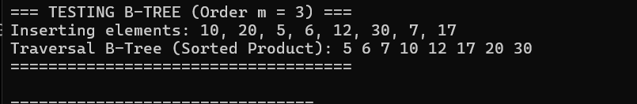
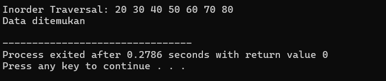

### B-Tree dan IMplementasinya
---

### 1. Karakteristik Komponen B-Tree (`BTreeNode`)

* **`vector<int> keys`**: Berbeda dengan *pohon biner* yang hanya menyimpan satu angka, di sini setiap node memiliki *array/vector* untuk menyimpan beberapa angka sekaligus. Angka-angka di dalam node ini **wajib selalu dalam kondisi terurut**.
* **`vector<BTreeNode*> children`**: Menyimpan alamat memori anak-anaknya. Jika sebuah node memiliki $N$ buah *keys*, maka dia otomatis akan memiliki $N + 1$ anak.
* **`int m` (Orde)**: Batas maksimal anak yang boleh dimiliki oleh sebuah node. Pada kode `main()`, nilai $m = 3$.
* Batas maksimal *key* di dalam satu node adalah $m - 1 = 2$ *keys*. Jika ada node yang mendapat *key* ketiga, node tersebut **wajib pecah (split)**.


* **`bool leaf`**: Penanda apakah node tersebut berada di lantai paling bawah (daun) atau masih memiliki anak.

---

### 2. Logika Penelusuran Terurut (`traverse`)

Fungsi ini mirip dengan *Inorder Traversal*, namun disesuaikan karena satu node isinya ada banyak angka:

* Program akan masuk ke anak pertama $\rightarrow$ mencetak *key* pertama $\rightarrow$ masuk ke anak kedua $\rightarrow$ mencetak *key* kedua $\rightarrow$ dan seterusnya.
* Logika perulangan `for` di dalam fungsi memastikan bahwa semua data dicetak dari yang paling kecil hingga yang paling besar (terurut).

---

### 3. Logika Memecah Node yang Penuh (`splitChild`)

Ini adalah jantung pertahanan dari B-Tree agar pohonnya tetap seimbang (tidak berat sebelah):

* Ketika sebuah node sudah penuh (berisi 2 *keys* pada orde $m=3$) dan ingin disisipi angka baru, fungsi ini akan memotong node tersebut di bagian tengah (*median/mid*).
* **Mekanisme Pecah:**
1. Angka yang berada di posisi tengah (`midKey`) akan **ditendang naik ke atas** untuk bergabung dengan node induk (*parent*).
2. Sisa angka di sebelah kanan dipindahkan ke node baru (`z`).
3. Sisa angka di sebelah kiri tetap tinggal di node lama (`y`).


---

### 4. Logika Penyisipan Data (`insert` & `insertNonFull`)

B-Tree menggunakan taktik **Preventif Split** (antisipasi dini). Sebelum menyisipkan angka, dia memastikan bahwa node yang dilewati tidak dalam kondisi sekarat/penuh, agar tidak terjadi efek domino pecah di kemudian hari.

* **`insert()` (Fungsi Utama):**
* Jika pohon masih kosong (`root == NULL`), langsung buat node baru sebagai *root*.
* Jika *root* ternyata sudah penuh (isi 2 angka), program langsung membuat node kosong baru di atasnya, menjadikan *root* lama sebagai anaknya, lalu melakukan `splitChild` pada *root* lama tersebut. Setelah rapi, barulah angka baru dimasukkan lewat `insertNonFull`.


* **`insertNonFull()` (Fungsi Pembantu):**
* **Jika di Leaf (Daun):** Cari posisi indeks yang tepat (sambil menggeser angka-angka yang lebih besar ke kanan), lalu selipkan angka baru tersebut di sana.
* **Jika di Node Internal (Bukan Leaf):** Cari jalur anak mana yang harus dituju. Sebelum melompat ke anak tersebut, cek apakah anak itu penuh atau tidak. Jika penuh, lakukan `splitChild` terlebih dahulu baru melompat masuk.


---

### Ilustrasi Kronologi Eksekusi pada `main()` (Orde $m = 3$):

Mari kita bedah bagaimana pohon ini tumbuh selangkah demi selangkah di memori:

1. **`insert(10)` dan `insert(20)**`
* Kedua angka masuk ke root yang sama karena kapasitas maksimal adalah 2.
* *Bentuk:* `[ 10 , 20 ]`


2. **`insert(5)`**
* Angka `5` membuat node penuh (menjadi `5, 10, 20`).
* Nilai tengah (`10`) ditendang naik menjadi *root* baru. Angka `5` di kiri, `20` di kanan.
* *Bentuk:*
```text
      [ 10 ]
     /      \
  [ 5 ]    [ 20 ]

```


3. **`insert(6)`**
* Angka `6` diarahkan ke anak kiri karena $6 < 10$. Masuk ke samping angka `5`.
* *Bentuk:*
```text
      [ 10 ]
     /      \
  [ 5 , 6 ]  [ 20 ]

```


4. **`insert(12)` dan `insert(30)**`
* Angka `12` dan `30` diarahkan ke anak kanan karena lebih besar dari `10`. Anak kanan sempat penuh dan pecah, melempar nilai `20` naik ke *root*.
* *Bentuk Akhir setelah semua angka (termasuk 7 dan 17) masuk:*
```text
           [ 10 ]
         /        \
    [ 6 ]          [ 20 ]
   /     \        /      \
[ 5 ]   [ 7 ]  [ 12, 17 ] [ 30 ]

```


### Hasil Output Program:

Ketika ditelusuri menggunakan `traverse()`, hasilnya akan keluar secara berurutan rapi:

```text
=== TESTING B-TREE (Order m = 3) ===
Inserting elements: 10, 20, 5, 6, 12, 30, 7, 17
Traversal B-Tree (Sorted Product): 5 6 7 10 12 17 20 30
====================================

```


### BST dan Implementasinya

---

### 1. Fondasi Node (`struct Node` & `createNode`)

* **`struct Node`**: Kerangka dasar yang mirip dengan pohon biner sebelumnya, memiliki wadah `data`, serta pointer `left` (kiri) dan `right` (kanan).
* **`createNode(int value)`**: Fungsi praktis untuk memesan memori bagi node baru, mengisi datanya dengan `value`, dan mengeset tangan kiri serta kanannya ke `NULL` karena belum memiliki anak.

### 2. Logika Menyisipkan Data (`insert`)

Fungsi ini otomatis menempatkan angka baru di posisi yang tepat agar aturan BST tidak rusak, menggunakan teknik **Rekursif**:

* **Kondisi Kosong (`root == NULL`)**: Jika cabang atau tempat yang dituju masih kosong, program akan langsung membuat node baru di sana menggunakan `createNode(value)`.
* **Belok Kiri (`value < root->data`)**: Jika angka yang ingin dimasukkan lebih kecil dari data induk saat ini, program akan melompat dan memeriksa cabang sebelah kiri (`root->left`).
* **Belok Kanan (`value > root->data`)**: Jika angka yang ingin dimasukkan lebih besar, program akan melompat dan memeriksa cabang sebelah kanan (`root->right`).

### 3. Logika Pencarian Data (`search`)

Berkat aturan kiri-lebih-kecil dan kanan-lebih-besar, fungsi pencarian tidak perlu memeriksa seluruh isi pohon, melainkan cukup mengeliminasi jalur yang salah (seperti tebak angka):

* **`root == NULL`**: Jika pencarian sampai ke ujung pohon dan tidak menemukan apa-apa, fungsi mengembalikan nilai `false` (data tidak ada).
* **`root->data == key`**: Jika angka pada node yang sedang dikunjungi sama dengan angka yang dicari, fungsi mengembalikan nilai `true` (ketemu!).
* **Eliminasi Jalur**:
* Jika angka yang dicari (`key`) lebih kecil dari node saat ini, program langsung fokus mencari ke cabang **kiri** saja.
* Jika lebih besar, program langsung fokus mencari ke cabang **kanan** saja.


### 4. Logika Menampilkan Data (`inorder`)

Sama seperti yang sudah kita bahas sebelumnya, *Inorder Traversal* mengunjungi pohon dengan urutan **Kiri $\rightarrow$ Induk $\rightarrow$ Kanan**.

* **Sifat Spesial pada BST**: Jika fungsi `inorder` dijalankan pada sebuah Binary Search Tree, hasil cetakan angkanya di layar dijamin akan **otomatis berurutan dari yang paling kecil hingga yang paling besar**.

---

### Ilustrasi Kronologi Struktur Pohon pada `main()`:

Berikut adalah bentuk pohon BST yang terbentuk dari urutan angka yang kamu masukkan (`50, 30, 70, 20, 40, 60, 80`):

1. `50` masuk pertama kali $\rightarrow$ Menjadi **Root**.
2. `30` masuk $\rightarrow$ Karena $30 < 50$, dia menjadi anak **kiri** dari 50.
3. `70` masuk $\rightarrow$ Karena $70 > 50$, dia menjadi anak **kanan** dari 50.
4. `20` masuk $\rightarrow$ Lebih kecil dari 50 (ke kiri), lebih kecil dari 30 (ke kiri lagi).
5. `40` masuk $\rightarrow$ Lebih kecil dari 50 (ke kiri), lebih besar dari 30 (ke kanan).

```text
          [ 50 ]          <-- Root
         /      \
     [ 30 ]    [ 70 ]
     /    \    /    \
   [20]  [40][60]  [80]

```

### Jalannya Eksekusi Akhir:

* **`inorder(root)`**: Akan mencetak data dari kiri ke kanan.
Output: `Inorder Traversal: 20 30 40 50 60 70 80`
* **`search(root, 60)`**: Program mengecek `50` $\rightarrow$ karena $60 > 50$, belok kanan ke `70` $\rightarrow$ karena $60 < 70$, belok kiri ke `60` $\rightarrow$ **Ketemu!**
Output: `Data ditemukan`


