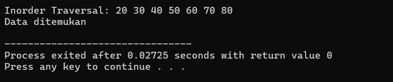
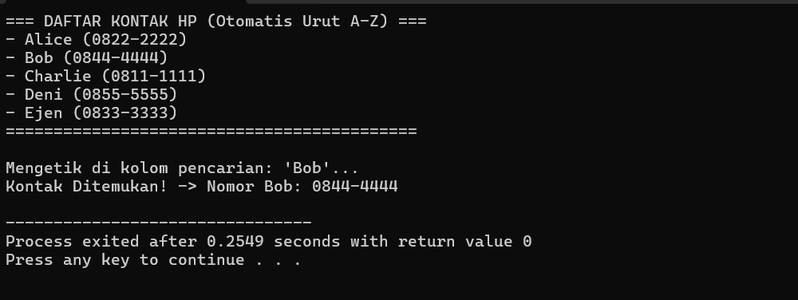

### BST dan Implementasinya

---

### 1. Fondasi Node (`struct Node` & `createNode`)

* **`struct Node`**: Kerangka dasar yang mirip dengan pohon biner sebelumnya, memiliki wadah `data`, serta pointer `left` (kiri) dan `right` (kanan).
* **`createNode(int value)`**: Fungsi praktis untuk memesan memori bagi node baru, mengisi datanya dengan `value`, dan mengeset tangan kiri serta kanannya ke `NULL` karena belum memiliki anak.

### 2. Logika Menyisipkan Data (`insert`)

Fungsi ini otomatis menempatkan angka baru di posisi yang tepat agar aturan BST tidak rusak, menggunakan teknik **Rekursif**:

* **Kondisi Kosong (`root == NULL`)**: Jika cabang atau tempat yang dituju masih kosong, program akan langsung membuat node baru di sana menggunakan `createNode(value)`.
* **Belok Kiri (`value < root->data`)**: Jika angka yang ingin dimasukkan lebih kecil dari data induk saat ini, program akan melompat dan memeriksa cabang sebelah kiri (`root->left`).
* **Belok Kanan (`value > root->data`)**: Jika angka yang ingin dimasukkan lebih besar, program akan melompat dan memeriksa cabang sebelah kanan (`root->right`).

### 3. Logika Pencarian Data (`search`)

Berkat aturan kiri-lebih-kecil dan kanan-lebih-besar, fungsi pencarian tidak perlu memeriksa seluruh isi pohon, melainkan cukup mengeliminasi jalur yang salah (seperti tebak angka):

* **`root == NULL`**: Jika pencarian sampai ke ujung pohon dan tidak menemukan apa-apa, fungsi mengembalikan nilai `false` (data tidak ada).
* **`root->data == key`**: Jika angka pada node yang sedang dikunjungi sama dengan angka yang dicari, fungsi mengembalikan nilai `true` (ketemu!).
* **Eliminasi Jalur**:
* Jika angka yang dicari (`key`) lebih kecil dari node saat ini, program langsung fokus mencari ke cabang **kiri** saja.
* Jika lebih besar, program langsung fokus mencari ke cabang **kanan** saja.


### 4. Logika Menampilkan Data (`inorder`)

Sama seperti yang sudah kita bahas sebelumnya, *Inorder Traversal* mengunjungi pohon dengan urutan **Kiri $\rightarrow$ Induk $\rightarrow$ Kanan**.

* **Sifat Spesial pada BST**: Jika fungsi `inorder` dijalankan pada sebuah Binary Search Tree, hasil cetakan angkanya di layar dijamin akan **otomatis berurutan dari yang paling kecil hingga yang paling besar**.

---

### Ilustrasi Kronologi Struktur Pohon pada `main()`:

Berikut adalah bentuk pohon BST yang terbentuk dari urutan angka yang kamu masukkan (`50, 30, 70, 20, 40, 60, 80`):

1. `50` masuk pertama kali $\rightarrow$ Menjadi **Root**.
2. `30` masuk $\rightarrow$ Karena $30 < 50$, dia menjadi anak **kiri** dari 50.
3. `70` masuk $\rightarrow$ Karena $70 > 50$, dia menjadi anak **kanan** dari 50.
4. `20` masuk $\rightarrow$ Lebih kecil dari 50 (ke kiri), lebih kecil dari 30 (ke kiri lagi).
5. `40` masuk $\rightarrow$ Lebih kecil dari 50 (ke kiri), lebih besar dari 30 (ke kanan).

```text
          [ 50 ]          <-- Root
         /      \
     [ 30 ]    [ 70 ]
     /    \    /    \
   [20]  [40][60]  [80]

```

### Jalannya Eksekusi Akhir:

* **`inorder(root)`**: Akan mencetak data dari kiri ke kanan.
Output: `Inorder Traversal: 20 30 40 50 60 70 80`
* **`search(root, 60)`**: Program mengecek `50` $\rightarrow$ karena $60 > 50$, belok kanan ke `70` $\rightarrow$ karena $60 < 70$, belok kiri ke `60` $\rightarrow$ **Ketemu!**
Output: `Data ditemukan



### Implementasi BST dalam Manajemen Kontak HP

---

### 1. Struktur Data Kontak (`ContactNode` & `createContact`)

* **`ContactNode`**: Setiap kontak (node) di memori bertindak seperti kartu nama digital yang menyimpan dua informasi penting: teks `name` (Nama) dan teks `phoneNumber` (Nomor Telepon).
* **Pointer `left` dan `right**`: Bertugas sebagai navigasi penunjuk ke kontak lain. `left` untuk menyimpan alamat kontak dengan abjad yang lebih kecil, sedangkan `right` untuk abjad yang lebih besar.
* **`createContact()`**: Fungsi praktis untuk mengalokasikan memori bagi kontak baru, mengisi data identitasnya, serta memastikan tangan kiri dan kanannya dalam keadaan kosong (`nullptr`).

### 2. Logika Menyusun Kontak Berdasarkan Abjad (`insertContact`)

Fungsi ini otomatis mengurutkan kontak saat pertama kali disimpan menggunakan perbandingan karakter (string):

* **Kondisi Kosong**: Jika buku telepon masih kosong (`root == nullptr`), kontak pertama yang dimasukkan (dalam kasus ini `"Charlie"`) akan langsung dinobatkan sebagai **Root** (pusat pohon).
* **Aturan Belok Kiri (`name < root->name`)**: Jika nama baru memiliki abjad lebih kecil secara urutan kamus (misalnya `"Alice"` dibandingkan dengan `"Charlie"`), program akan melompat ke cabang **kiri**.
* **Aturan Belok Kanan (`name > root->name`)**: Jika nama baru memiliki abjad lebih besar (misalnya `"Ejen"` atau `"Zack"` dibandingkan dengan `"Charlie"`), program akan melompat ke cabang **kanan**.

### 3. Logika Pencarian Cepat ala Kontak HP (`searchContact`)

Saat kamu mengetik nama di kolom pencarian, fungsi rekursif ini bekerja dengan cara mengeliminasi rute yang salah secara instan:

* **Kondisi Berhenti**: Jika nama yang dicari cocok dengan node yang sedang dikunjungi (`root->name == targetName`), fungsi langsung mengembalikan data kontak tersebut. Jika sampai ujung pohon tidak ketemu, ia mengembalikan `nullptr`.
* **Sistem Saring Jalur**:
* Jika nama yang dicari abjadnya lebih kecil dari posisi saat ini (misal mencari `"Bob"`, sementara posisi di `"Charlie"`), program langsung **mengabaikan seluruh kontak di cabang kanan** dan hanya melompat ke cabang **kiri**.
* Jika lebih besar, program langsung melompat ke cabang **kanan**. Hal inilah yang membuat pencarian terasa instan meskipun kontak berjumlah ribuan.


### 4. Logika Menampilkan Kontak Urut A-Z (`displayAllContacts`)

* Fungsi ini memanfaatkan sifat ajaib dari **Inorder Traversal** pada BST, dengan urutan langkah: **Kunjungi Kiri $\rightarrow$ Cetak Data $\rightarrow$ Kunjungi Kanan**.
* Karena struktur BST sudah rapi sejak awal (yang kecil di kiri, yang besar di kanan), penelusuran ini akan otomatis mencetak seluruh daftar kontak di layar dari abjad A hingga Z secara berurutan (`Alice`, `Bob`, `Charlie`, `Deni`, `Ejen`) tanpa perlu memproses pengurutan ulang (*sorting*) yang memakan memori.

---

### Ilustrasi Alur Pohon yang Terbentuk di Memori:

```text
          [ Charlie ]          <-- Root Utama
         /           \
     [ Alice ]       [ Ejen ]
      /    \
   NULL   [ Bob ]  <-- Tempat "Bob" Menetap (Kanan dari Alice)

```

output:


