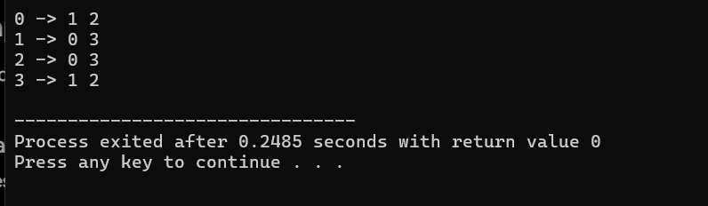
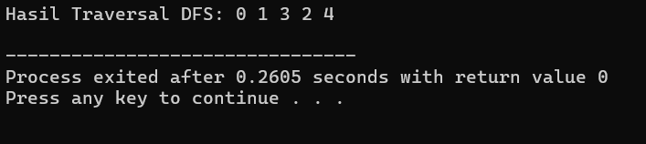
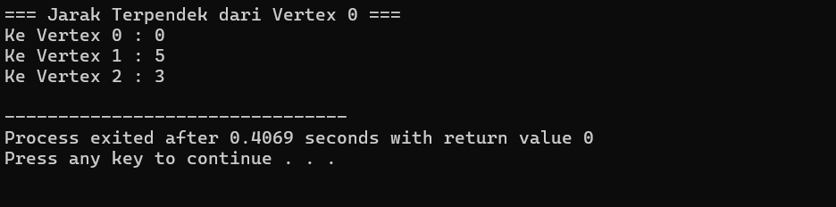

## Graf (Graph)

### 1. Definisi dan Komponen Utama

* 
**Definisi:** Graf adalah struktur data non-linear yang digunakan untuk menggambarkan hubungan/relasi antar objek.


* **Komponen Dasar:**
* 
**Vertex ($V$ / Node / Simpul):** Titik atau objek dalam graf. Contoh: Nama kota, user media sosial, atau router jaringan.


* 
**Edge ($E$ / Sisi):** Garis penghubung yang merepresentasikan hubungan antar vertex.


* 
**Degree:** Jumlah total edge yang terhubung langsung ke suatu vertex.


### 2. Jenis-Jenis Graf

* 
**Undirected Graph:** Graf dengan hubungan dua arah (simetris). Contoh: Pertemanan di Facebook.


* 
**Directed Graph (Digraph):** Graf dengan hubungan satu arah bermata panah. Contoh: Sistem *follower* di Instagram.


* 
**Weighted Graph:** Graf yang setiap edge-nya memiliki bobot atau nilai tertentu (seperti jarak, biaya, atau waktu). Contoh: Google Maps.


* 
**Cyclic vs Acyclic Graph:** *Cyclic* memiliki jalur melingkar yang bisa kembali ke titik asal, sedangkan *Acyclic* tidak memiliki siklus sama sekali.


### 3. Representasi Graf dalam Kode

* 
**Adjacency Matrix:** Menggunakan array/matriks 2 dimensi berukuran $V \times V$.


* 
*Kelebihan:* Mudah diimplementasikan.


* 
*Kekurangan:* Boros memori ($O(V^2)$).


* 
**Adjacency List:** Menggunakan array dinamis (`vector`) untuk mencatat daftar tetangga langsung dari setiap vertex.


* 
*Kelebihan:* Hemat memori ($O(V+E)$).


### 4. Algoritma Traversal & Shortest Path

* 
**DFS (Depth First Search):** Menjelajahi node sedalam mungkin ke bawah terlebih dahulu sebelum kembali ke atas (*backtrack*). Menggunakan prinsip tumpukan secara rekursif.


* 
**BFS (Breadth First Search):** Menjelajahi node secara melebar atau per level. Algoritma ini wajib menggunakan bantuan struktur data **Queue (Antrean)**.


* 
**Algoritma Dijkstra:** Algoritma populer yang digunakan untuk mencari jalur terpendek (*Shortest Path*) dari satu titik ke titik lainnya pada graf berbobot.


---

## 💻 Kode Implementasi Utama (C++)

Berikut adalah 3 contoh kode implementasi penting yang diekstrak dari dokumen tersebut:

### A. Implementasi Adjacency List (Hemat Memori)

Kode ini merepresentasikan graf menggunakan vektor saling bertaut (`vector<vector<int>>`).

```cpp
#include <iostream>
#include <vector>

using namespace std;

class Graph {
private:
    int V;
    vector<vector<int>> adj;

public:
    Graph(int vertices) {
        V = vertices;
        adj.resize(V);
    }

    void addEdge(int u, int v) {
        adj[u].push_back(v); // Menghubungkan u ke v
        adj[v].push_back(u); // Menghubungkan v ke u (Undirected)
    }

    void display() {
        for (int i = 0; i < V; i++) {
            cout << i << " -> ";
            for (int node : adj[i]) {
                cout << node << " ";
            }
            cout << endl;
        }
    }
};

int main() {
    Graph g(4);
    g.addEdge(0, 1);
    g.addEdge(0, 2);
    g.addEdge(1, 3);
    g.addEdge(2, 3);

    g.display();
    return 0;
}

```
output:



### B. Implementasi Traversal DFS (Depth First Search)

Kode untuk menelusuri graf secara mendalam menggunakan rekursi.

```cpp
#include <iostream>
#include <vector>

using namespace std;

class GraphDFS {
private:
    int V;
    vector<vector<int>> adj;
    vector<bool> visited;

public:
    GraphDFS(int vertices) {
        V = vertices;
        adj.resize(V);
        visited.resize(V, false);
    }

    void addEdge(int u, int v) {
        adj[u].push_back(v);
        adj[v].push_back(u);
    }

    void DFS(int v) {
        visited[v] = true;
        cout << v << " ";

        for (int u : adj[v]) {
            if (!visited[u]) {
                DFS(u); // Memanggil dirinya sendiri (Rekursif)
            }
        }
    }
};

int main() {
    GraphDFS g(5);
    g.addEdge(0, 1);
    g.addEdge(0, 2);
    g.addEdge(1, 3);
    g.addEdge(2, 4);

    cout << "Hasil Traversal DFS: ";
    g.DFS(0); // Output: 0 1 3 2 4
    cout << endl;

    return 0;
}

```

output:



### C. Implementasi Algoritma Dijkstra (Shortest Path)

Kode untuk mencari jarak minimum dari satu titik awal (`start`) ke seluruh vertex lainnya menggunakan `priority_queue`.

```cpp
#include <iostream>
#include <vector>
#include <queue>

using namespace std;

const int INF = 1000000; // Representasi nilai tak hingga
vector<pair<int, int>> graph[100]; // Array of pair untuk menyimpan {tetangga, bobot}

void dijkstra(int start, int V) {
    vector<int> dist(V, INF);
    // Priority queue untuk mengambil bobot terkecil secara otomatis
    priority_queue<pair<int, int>, vector<pair<int, int>>, greater<pair<int, int>>> pq;

    dist[start] = 0;
    pq.push({0, start}); // Menyimpan {jarak, vertex}

    while (!pq.empty()) {
        int u = pq.top().second;
        pq.pop();

        for (auto edge : graph[u]) {
            int v = edge.first;
            int w = edge.second;

            // Relaksasi Edge: Cek apakah ada jalur yang lebih murah/pendek
            if (dist[v] > dist[u] + w) {
                dist[v] = dist[u] + w;
                pq.push({dist[v], v});
            }
        }
    }

    cout << "=== Jarak Terpendek dari Vertex " << start << " ===\n";
    for (int i = 0; i < V; i++) {
        cout << "Ke Vertex " << i << " : " << dist[i] << endl;
    }
}

int main() {
    int V = 3; // Misal ada 3 kota (0: Surabaya, 1: Sidoarjo, 2: Gresik)
    
    // Hubungkan kota beserta bobotnya (jarak)
    graph[0].push_back({1, 5}); // Surabaya -> Sidoarjo (5km)
    graph[1].push_back({0, 5}); 
    graph[0].push_back({2, 3}); // Surabaya -> Gresik (3km)
    graph[2].push_back({0, 3});

    dijkstra(0, V); // Cari rute terpendek dimulai dari Surabaya (0)
    return 0;
}

```
output:


