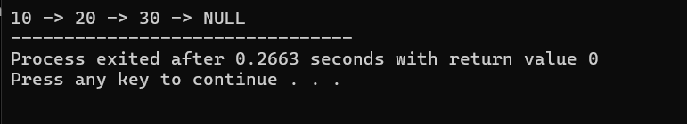

### Linked List
---

### 1. Struktur Pembuat Gerbong (`struct Node`)

* Di bagian atas, kamu mendefinisikan sebuah tipe data baru bernama `Node`.
* Bayangkan `Node` ini sebagai satu **gerbong kereta**. Setiap gerbong wajib memiliki dua ruangan:
* **`int data`**: Tempat untuk menyimpan barang/nilai berupa angka bulat.
* **`Node* next`**: Sebuah kompartemen khusus (pointer) yang bertugas menyimpan alamat memori gerbong selanjutnya. Ini berfungsi sebagai "rantai" pengait antar-gerbong.


### 2. Alokasi Memori (`new Node()`)

Di dalam `main()`, perintah ini dijalankan:

```cpp
Node* node1 = new Node();
Node* node2 = new Node();
Node* node3 = new Node();

```

* Kata kunci `new` artinya kamu memerintahkan komputer untuk memesan 3 slot kosong baru di memori (Heap) secara acak.
* `node1`, `node2`, dan `node3` saat ini barulah berupa remote kontrol (pointer) yang memegang alamat dari masing-masing slot kosong tersebut.

### 3. Mengisi Barang ke Gerbong (`Isi data`)

```cpp
node1->data = 10;
node2->data = 20;
node3->data = 30;

```

* Tanda panah (`->`) digunakan untuk menunjuk ke dalam ruangan internal si Node.
* Di sini, kamu memasukkan angka `10` ke dalam ruangan data milik `node1`, angka `20` ke `node2`, dan angka `30` ke `node3`. Pada tahap ini, ketiga gerbong **belum saling kenal** (masih terpisah-pisah).

### 4. Merangkai Gerbong (`Hubungkan node`)

Proses inilah yang menyatukan mereka menjadi sebuah *Linked List*:

```cpp
node1->next = node2; // Rantai node1 mengait ke node2
node2->next = node3; // Rantai node2 mengait ke node3
node3->next = NULL;  // Node3 tidak mengait ke siapa-siapa (ujung kereta)

```

* Nilai `NULL` pada gerbong terakhir (`node3`) sangat krusial. Ini adalah tanda batas mutlak bagi komputer bahwa kereta telah habis dan tidak ada gerbong lagi di depannya.

### 5. Berjalan Menelusuri Kereta (`Traversal`)

```cpp
Node* current = node1;

```

* Kamu membuat satu pointer bantuan bernama `current` (artinya: posisi saat ini). Mula-mula, kamu posisikan `current` ini berdiri di gerbong pertama (`node1`).

```cpp
while (current != NULL) {
    cout << current->data << " -> ";
    current = current->next;
}

```

* Perulangan `while` akan terus berjalan selama `current` tidak berada di tempat kosong (`NULL`).
* **Cara kerjanya per langkah:**
1. **Loop 1:** `current` ada di `node1`. Program mencetak datanya (`10`). Lalu perintah `current = current->next` membuat kamu melompat ke alamat yang ditunjuk oleh `node1->next`, yaitu `node2`.
2. **Loop 2:** `current` sekarang ada di `node2`. Program mencetak datanya (`20`). Kamu melompat lagi lewat `node2->next` menuju `node3`.
3. **Loop 3:** `current` ada di `node3`. Program mencetak datanya (`30`). Kamu membaca `node3->next` yang bernilai `NULL`. Maka, nilai `current` berubah menjadi `NULL`.
4. **Selesai:** Karena `current` sudah bernilai `NULL`, perulangan `while` otomatis berhenti.


---

### Hasil Akhir Output di Layar:

```text
10 -> 20 -> 30 -> NULL

```

output:


